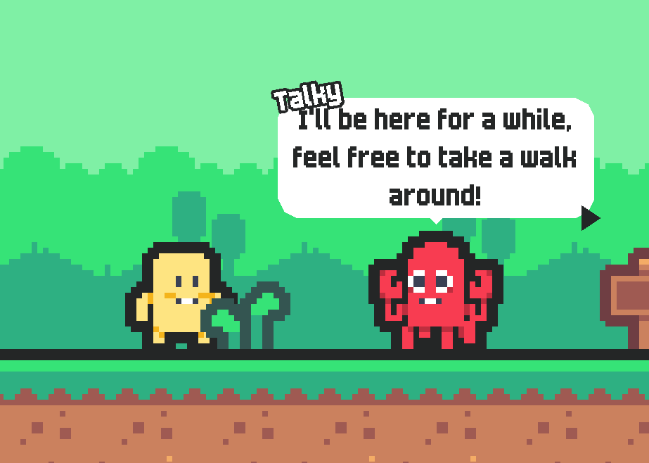
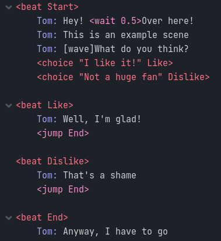

  

# GDrama
GDrama is a simple framework for writing cutscenes in Godot. It supports a bunch of features that you might expect from any game that includes dialogue, such as choices, dialogue boxes and character animations! This addon was made to provide a base from which a developer may create their cutscene system considering the particular needs of their game

  

## Quickstart

A more thorough tutorial may be created in the future if there's demand for it. For now, you can explore the example project provided to see to use GDrama in practice!

## How it works

The GDrama language is used to write cutscenes inside the Godot editor. It is meant to resemble a screenplay! Here's what a simple dialogue looks like

The .gdrama files created within Godot will be automatically imported and processed during runtime. They follow a simple pipeline:

1. Importer - Processes the .gdrama file into a resource that can be used by Godot
2. DramaReader - Will read a GDramaResource and supply lines in order so they can be animated
3. DramaAnimator - Will take in lines and animated them

For starting more quickly, two nodes can be set up to run dramas very easily. These are:

- DramaDisplay - Used to display dialogue and run animation calls. Can be, for instance, a dialogue bubble
- DramaInterface - Used for starting a particular drama. Can be seen as a connection between regular gameplay and a cutscene

## Commands

Commands used in GDrama are enveloped in **<>**. Depending on the command, they can be processed at different parts of the drama pipeline

### Importer

These commands appear as red in the GDrama syntax highlighter and are processed in the importing stage.

|Command|Use|
|---|---|
|<beat BeatName\>|Defines a new beat. Beats are labels that can be jumped between in the middle of dialogue|
|<choice "Choice text" ResultingBeat <condition_call>>|Defines a new choice bundled with the choices declared next to it. If it is chosen, the dialogue will skip to the specified ResultingBeat. Can also include a call that will be triggered when this choice is called so that the choice will only be valid if it returns true|
|<end "Info">|Ends the drama. Can include information about the ending|
|<const name value\>|Defines a constant with the specified value. This constant can be accesed in the drama by using $name or \$"name"|
|<import path\>|Imports all constants from the given drama|

### DramaReader
Commands from here on will appear as pink in the GDrama syntax highlighter. From here, the developer is encouraged to create commands of their own to fit their needs.

DramaReader commands will be processed while the next line to be processed is being chosen. As such, they are particularly well suited to tasks such as navigating the drama in unique ways or substituting fields in the text, like getting the player's name. These are the built-in DramaReader commands.

|Command|Use|
|---|---|
|<jump BeatName\>|Jumps to the specified beat|
|<flag FlagName\>|Turns a flag on. These flags are saved locally in the DramaReader object but this implementation can be modified to, for instance, save them somewhere all dramas can access|
|<unflag FlagName\>|Turns a flag off|
|<get_flag FlagName\>|Gets the value of a flag|
|<branch TargetBeat FlagName\>|If the given flag is active, jumps to the specified beat, otherwise, goes to the next line|

### DramaAnimator
Handles commands that are meant to play mid-animation, such as creating a pause between words or changing a character's speaking speed. Commands that aren't processed by the DramaAnimator will be aired out to all DramaDisplays connected to it - that's when commands you defined in them will run.

These are the built-in DramaAnimator commands

|Command|Use|
|---|---|
|<speed time\>|Changes the time waited between characters|
|<wait time\>|Waits the specified time before continuing the animation|

## Resources

[Vim syntax highlighting for GDrama](https://github.com/squk/gdrama-syntax.vim) made by @squk

## Copyright

Copyright/attribution is not required, though appreciated. Credit me as Moraguma and link to https://moraguma.itch.io/
